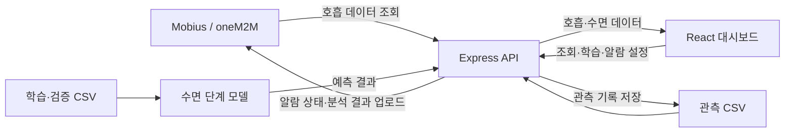

# 숙면의호흡 · Sleeper

**호흡 데이터 수집부터 수면 상태 예측, 기상 알람까지 연결하는 IoT 수면 모니터링 웹 서비스**

숙면의호흡은 밤사이의 호흡 변화와 수면 흐름을 한 화면에서 살펴볼 수 있도록 만든 프로젝트입니다. 저장된 CSV 분석부터 Mobius(oneM2M) 플랫폼의 실시간 데이터 수집, 수면 단계 모델 학습, 알람 상태 전송까지 하나의 웹 서비스로 연결했습니다.

## 프로젝트 목표

센서에서 얻은 숫자를 사용자가 이해할 수 있는 정보로 바꾸는 데 초점을 맞췄습니다. 호흡수와 수면 단계를 같은 시간축으로 보여주고, 수면 단계 비율과 호흡 이벤트를 요약해 수면 기록을 쉽게 돌아볼 수 있도록 구성했습니다.

이 저장소에는 **웹 대시보드, 백엔드 API, 데이터 처리 및 모델 학습 코드**가 포함되어 있습니다.

## 주요 기능

| 기능 | 구현 내용 |
| --- | --- |
| 수면 대시보드 | 호흡수·수면 단계 시계열 차트, 시간 구간 선택, 수면 단계 비율 표시 |
| 호흡 이벤트 분석 | 무호흡·뒤척임 구간 시각화, 관측 시간 기준 시간당 무호흡 지표 계산 |
| CSV 기록 조회 | 저장된 관측 파일을 선택해 이전 수면 기록 확인 |
| 실시간 모니터링 | Mobius의 호흡 데이터를 기본 30초 간격으로 조회하고, 5분 간격으로 예측 및 백업 갱신 |
| 수면 단계 예측 | 호흡수 특징을 이용해 깸(Wake)·REM·NREM 3개 상태로 분류 |
| 모델 관리 | 학습 CSV 업로드, 재학습, 모델 버전 저장, 학습셋·검증셋 정확도 확인 |
| 플랫폼 데이터 관리 | 과거 호흡 데이터 조회·CSV 저장 및 기능별 컨테이너 업로드 API |
| 기상 알람 | 예약 시각 전 30분 동안 깸·REM 상태를 확인해 알람을 활성화하고, 예약 시각에는 수면 단계와 관계없이 활성화 |

알람은 Mobius 컨테이너에 상태를 전송하는 방식입니다. 실시간 모니터링이 실행 중일 때 폴링과 예측 갱신 과정에서 조건을 평가하며, 예약 시각 1분 이후에는 알람 상태를 해제합니다.

## 서비스 구조



## 기술 스택

| 영역 | 사용 기술 |
| --- | --- |
| 프론트엔드 | React 18, TypeScript, Vite 5, Recharts |
| 백엔드 | Node.js, Express, TypeScript |
| IoT 연동 | Mobius, oneM2M REST API |
| 데이터·모델 | CSV, TypeScript로 구현한 softmax 선형 분류 모델, JSON 모델 저장 |
| 검증 | Vitest, Testing Library, TypeScript 타입 검사 |
| 프로젝트 관리 | npm workspaces 기반 클라이언트·서버 모노레포 |

## 구현 포인트

### 수집부터 시각화까지 이어지는 데이터 흐름

플랫폼 통신, 데이터 가공, 모델 학습, 화면 표시를 클라이언트·서비스·라우터·컴포넌트로 나눴습니다. 실시간 모니터링을 시작할 때 현재 수면 세션의 기존 플랫폼 기록을 먼저 불러오고, 이후 새 데이터를 수집합니다. 수집 결과는 CSV로 저장해 다시 조회할 수 있습니다.

### 호흡수 기반의 수면 단계 분류

최근 호흡수 표본에서 현재값, 이전값, 평균, 표준편차, 최솟값·최댓값, 변화량 등 10개 특징을 추출합니다. 특징을 표준화한 뒤 클래스별 가중치를 적용한 softmax 분류 모델을 학습합니다. 기존 Light·Deep 라벨은 NREM으로 통합합니다.

학습 결과에는 모델 버전, 학습 시각, 사용 파일과 파일 지문, 평가 결과를 함께 저장합니다. 화면의 ‘추가 학습’도 현재 구현에서는 전체 학습 파일을 다시 읽어 모델을 재학습하는 방식입니다.

### 관측 조건을 반영한 분석

초기 30분을 분석 배제 구간으로 표시하고, 무호흡 요약과 실시간 수면 단계 예측에 반영했습니다. 무호흡 지표는 분석 대상 구간에서 호흡값이 0인 표본 수를 관측 시간으로 나누어 계산합니다. 표본 간격에 영향을 받는 프로젝트 내부 지표이며, 임상적으로 검증된 진단 결과를 의미하지 않습니다.

### 수면 상태와 예약 시각을 함께 고려한 알람

새 호흡 데이터가 없는 폴링에서도 알람 조건을 평가하도록 구성했습니다. 예측 결과의 갱신 여부와 별개로 예약 시각을 확인할 수 있도록 한 설계입니다.

## 로컬 실행

Node.js와 npm이 설치된 환경에서 실행합니다.

```bash
git clone https://github.com/hashZiwa/Krrrr.git
cd Krrrr
npm install
npm run dev
```

- 웹 대시보드: http://localhost:5173
- 백엔드 API: http://localhost:4000
- 서버 상태 확인: http://localhost:4000/api/health

### 플랫폼 계정 없이 둘러보기

Mobius 환경 변수가 없는 환경에서는 `.env` 없이 시작할 수 있습니다. 화면에서 저장된 관측 CSV를 선택해 차트와 분석 결과를 확인하고, 학습 패널에서 저장소에 포함된 데이터로 모델을 학습할 수 있습니다. 실시간 수집과 플랫폼 알람 제어에는 별도 연동 설정이 필요합니다.

### Mobius 연동

루트의 `.env.example`을 `.env`로 복사하고 실제 계정·플랫폼 정보를 입력합니다.

| 설정 | 용도 |
| --- | --- |
| `MOBIUS_BASE_URL`, `MOBIUS_AE_PATH` | 플랫폼 주소 및 AE 경로 |
| `MOBIUS_X_M2M_RI`, `MOBIUS_X_M2M_ORIGIN` | oneM2M 요청 식별자 및 요청 주체 |
| `MOBIUS_API_KEY`, `MOBIUS_AUTH_CUSTOM_CREATOR`, `MOBIUS_AUTH_CUSTOM_LECTURE` | 플랫폼 인증 정보 |
| `MOBIUS_STATUS_CONTAINER_BREATH_CONDITION` | 호흡 상태 조회 컨테이너 |
| `MOBIUS_UPLOAD_CONTAINER_*` | 기능별 업로드 컨테이너 |

알람을 사용하려면 `.env`에 아래 항목도 추가하고, 값에는 플랫폼에서 사용하는 실제 컨테이너 경로를 입력합니다.

```dotenv
MOBIUS_UPLOAD_CONTAINER_ALARM_ENABLED=your/alarm-enabled-container
MOBIUS_UPLOAD_CONTAINER_ALARM_TIME=your/alarm-time-container
MOBIUS_UPLOAD_CONTAINER_ALARM_STATUS=your/alarm-status-container
```

`SLEEP_DATA_SOURCE=mock`은 그대로 유지합니다. 이 설정은 기본 수면 세션 API의 데이터 공급자를 선택하며, 실제 Mobius 연동은 별도의 플랫폼 API에서 환경 설정을 통해 활성화됩니다. 현재 `SLEEP_DATA_SOURCE=mobius`로 바꾸면 서버가 시작되지 않습니다.

실시간 예측을 사용하기 전에는 학습 패널에서 모델을 학습해야 합니다. `.env`와 생성된 `model/`은 Git 추적 대상에서 제외됩니다.

## 폴더 구성

```text
Krrrr/
├── client/src/
│   ├── api/              # 백엔드 API 호출
│   ├── charts/           # 호흡·수면 단계 차트
│   ├── components/       # 분석·학습·알람·데이터 선택 UI
│   └── data/             # 차트 변환 및 분석 로직
├── server/src/
│   ├── clients/          # Mobius 통신
│   ├── config/           # 환경 변수 및 플랫폼 설정
│   ├── ml/               # CSV 파싱, 특징 추출, 분류 모델
│   ├── routes/           # REST API
│   └── services/         # 수집·저장·학습·알람 처리
├── data/
│   ├── displaydata/       # 화면 조회용 관측 CSV
│   └── rawdata/
│       ├── train/        # 학습 데이터
│       └── validation/   # 검증 데이터
├── model/                # 실행 후 생성되는 모델 파일 (Git 제외)
└── .env.example          # 플랫폼 연동 설정 예시
```

## 검증 명령

```bash
npm run test
npm run typecheck
npm run build
```

테스트는 CSV 처리와 특징 추출, 모델 학습·저장, 플랫폼 API, 실시간 모니터링, 알람 조건, 차트 변환과 UI 로직을 다룹니다. 실제 플랫폼 접속과 외부 알람 장치 동작은 별도 연동 환경에서 확인해야 합니다.

## 향후 개선 방향

- 더 다양한 수면 기록으로 검증 데이터 확대 및 수면 단계별 예측 성능 평가
- 표본 간격과 데이터 누락을 고려한 특징 추출·호흡 이벤트 분석 개선
- 사용자별 수면 이력 관리와 장기간 변화 비교
- CI 자동 검증 및 서비스 배포 환경 구성
